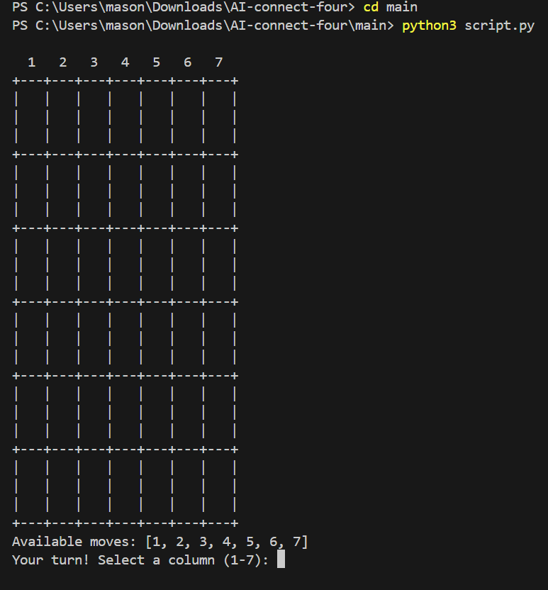
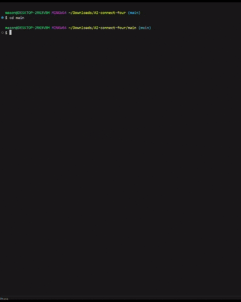

# AI Connect Four

A Python implementation of the classic Connect Four game with an AI opponent.  
Play locally against an AI that evaluates the game board and chooses strong moves, making it a fun way to explore basic game AI concepts.

---

## Description

This project implements:

- A **Connect Four game engine** (board, moves, win/draw detection).
- An **AI opponent** that analyzes the board and selects moves programmatically.
- A **playable interface** so you can challenge the AI and visualize how it responds in real time.

## How to Use

### 1. Clone the repository

```bash
git clone https://github.com/MasonBoom/AI-connect-four.git
cd AI-connect-four
cd main
python3 main.py
```



## 2. Play the Game
- The game will prompt you to choose whether you want to go first or second.
- Enter the column number (1-7) where you want to drop your piece.
- The AI will automatically make its move after yours.
- The game continues until there is a winner or the board is full (draw).

## Demo



